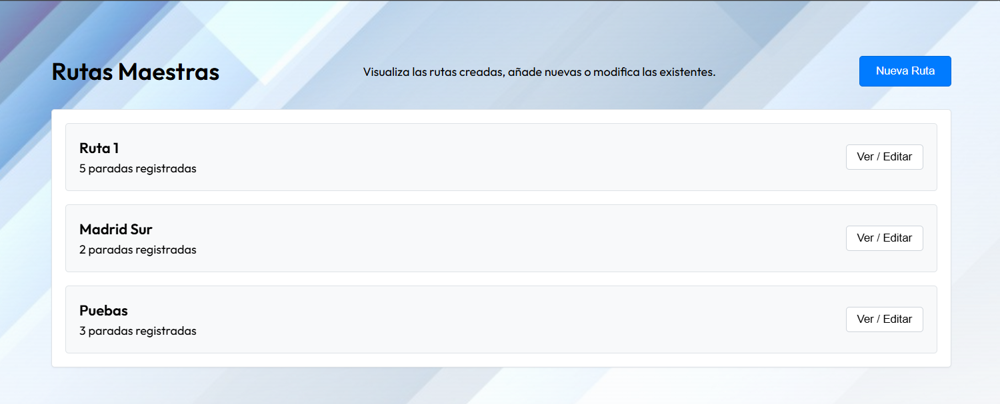
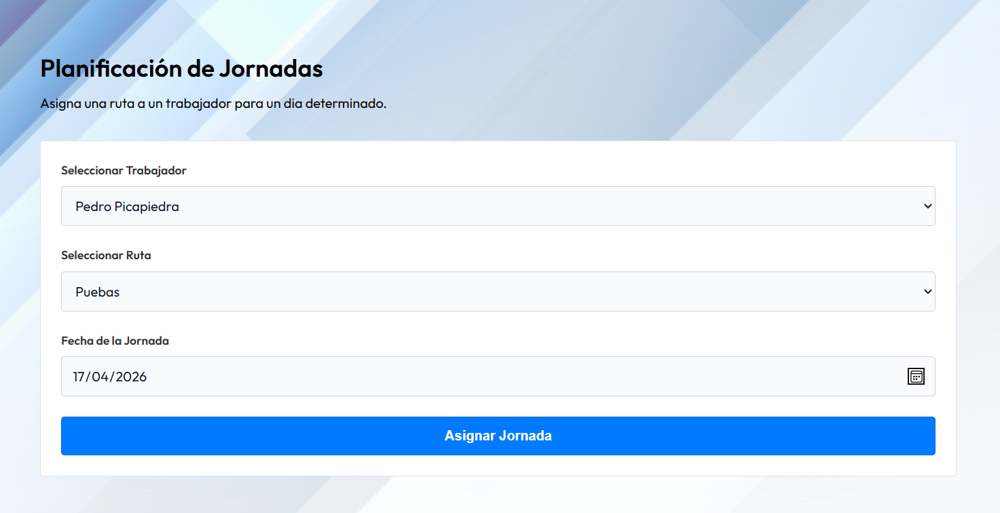
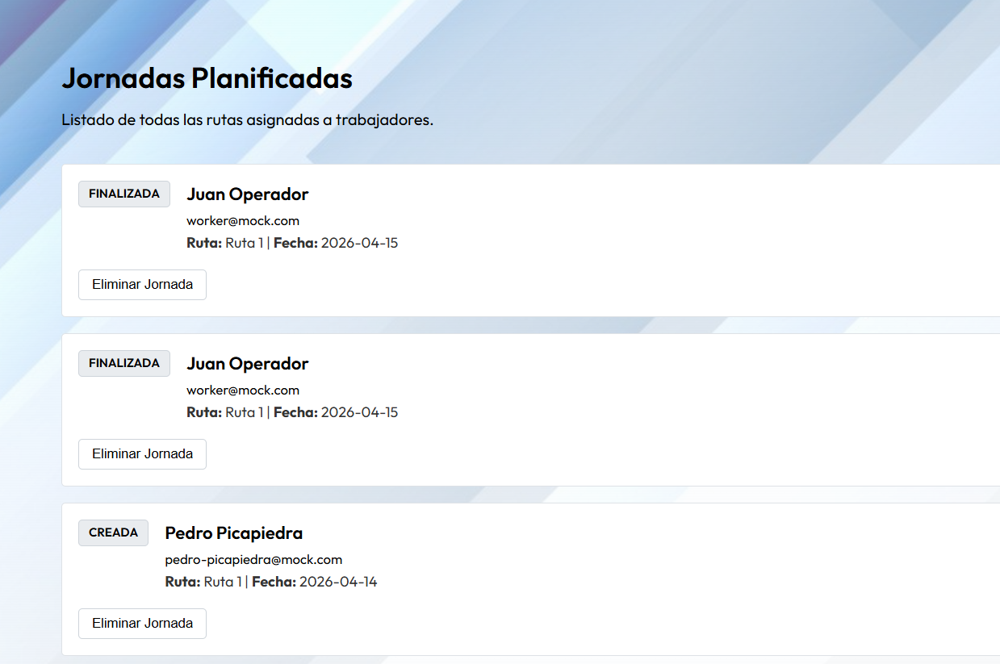
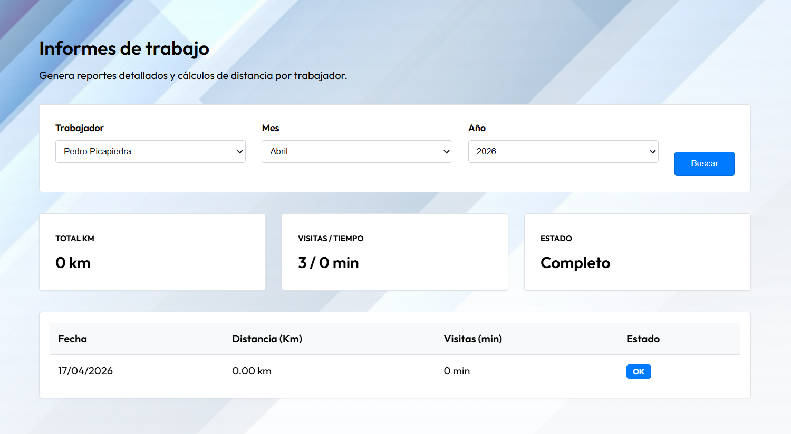

# TimeRoute


Aplicación web para gestionar clientes, trabajadores, rutas y jornadas laborales, desarrollada como proyecto final de Desarrollo de Aplicaciones Web.

**Angular 19 · TypeScript · SCSS · PHP · MySQL**

## Funcionalidades

| Administrador | Trabajador |
|---|---|
| Gestionar clientes y trabajadores. | Consultar su jornada asignada. |
| Crear rutas con paradas ordenadas. | Iniciar y finalizar la jornada. |
| Asignar rutas a trabajadores para una fecha. | Registrar llegadas y salidas de las visitas. |
| Consultar el estado de las jornadas. | Iniciar y finalizar descansos. |
| Consultar informes por trabajador y periodo. | Consultar jornadas finalizadas e informes propios. |

Los informes incluyen tiempos de visitas y estimaciones de distancia a partir de las coordenadas registradas. Las distancias se calculan entre puntos geográficos; no representan el recorrido por carretera.

## Capturas de la aplicación

### Rutas maestras

Creación y consulta de rutas con sus paradas.



### Planificación de jornadas

Asignación de una ruta a un trabajador para una fecha.



### Jornadas planificadas

Consulta de las jornadas asignadas y de su estado.



### Informes de trabajo

Consulta por trabajador y periodo, con tiempos de visitas y distancias estimadas.



## Tecnologías y organización

El frontend está desarrollado con Angular y se comunica mediante HTTP con una API en PHP. El backend utiliza PDO para acceder a una base de datos MySQL.

```text
src/
  app/
    admin/         Vistas de administración
    worker/        Vistas del trabajador
    components/    Componentes de interfaz
    services/      Comunicación con la API y servicios
  environments/    Configuración del frontend

backend/
  config/          Conexión a la base de datos y CORS
  controllers/     Lógica de los endpoints
  helpers/         Autenticación y respuestas
  sql/             Estructura y datos iniciales

public/            Recursos estáticos
```

## Puesta en marcha local

Se necesita Node.js con npm compatible con las dependencias del proyecto, PHP con el controlador PDO para MySQL y un servidor MySQL. Las versiones del entorno de ejecución están pendientes de validar mediante una instalación desde cero.

1. Clonar el repositorio e instalar las dependencias:

   ```bash
   git clone https://github.com/chicano76/TFG_Proyecto_DAW.git
   cd TFG_Proyecto_DAW
   npm install
   ```

2. Configurar la conexión a MySQL en `backend/config/database.php`.

3. En el cliente de MySQL, importar primero `backend/sql/db_schema.sql` y después `backend/sql/db_initializer.sql`.

4. Arrancar el backend desde la raíz del proyecto:

   ```bash
   cd backend
   php -S localhost:8000 index.php
   ```

5. En otra terminal, desde la raíz del proyecto:

   ```bash
   npm start
   ```

6. Abrir <http://localhost:4200>.

La dirección de la API se configura en `src/environments/environment.ts`. Actualmente apunta a `http://localhost:8000`.

Para iniciar una jornada, la aplicación solicita acceso a la ubicación del dispositivo.

## Documentación

- [Manual de usuario de TimeRoute](docs/manual-usuario-timeroute.pdf): guía de acceso, roles y uso de los módulos de la aplicación.
- [Documentación de los componentes de administración](docs/componentes-admin.pdf): descripción de los componentes, su lógica, estilos y pruebas documentadas.
